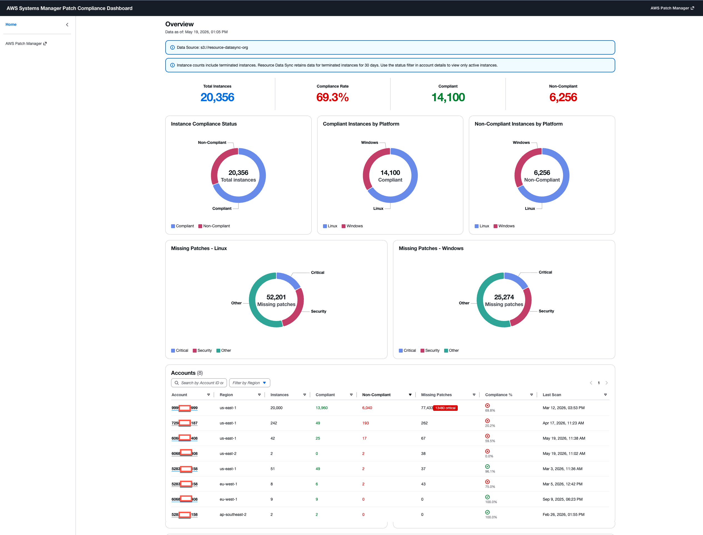
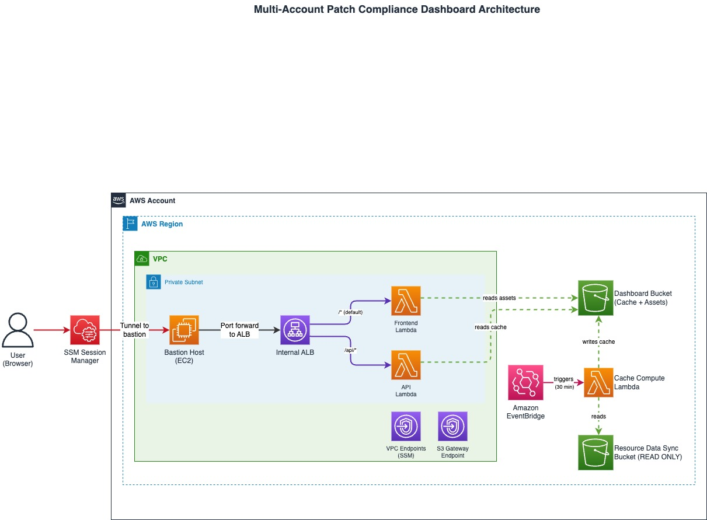

# Multi-Account Patch Compliance Dashboard

> **Disclaimer:** This is sample code, for non-production usage. You should work with your security and legal teams to meet your organizational security, regulatory and compliance requirements before deployment.

A serverless dashboard for visualizing patch compliance across multiple AWS accounts and regions. Built on AWS Systems Manager Resource Data Sync data, it provides a centralized view of patch status for thousands of EC2 instances.



## Contents

**Get started**
- [Prerequisites](#prerequisites)
- [Deployment](#deployment)
- [Accessing the Dashboard](#accessing-the-dashboard)

**Develop & operate**
- [Refreshing the cache manually](#refreshing-the-cache-manually)
- [TLS certificates](#tls-certificates)
- [Development](#development)

**Reference**
- [Features](#features)
- [Architecture](#architecture)
- [API Endpoints](#api-endpoints)
- [Project Structure](#project-structure)
- [Configuration](#configuration)
- [Cache Format](#cache-format)
- [Cost estimation](#cost-estimation)
- [Security](#security)

## Prerequisites

Before you deploy, make sure your local machine has these tools installed:

- AWS CLI v2
- Node.js 20+ and npm
- `python3` (any version 3.8+; used by `deploy.sh` for tear-down JSON manipulation, not for Lambda packaging)
- `openssl` (used by `setup-tls.sh` to generate the self-signed certificate)
- `zip` and `jq` (used by `deploy.sh`)
- The [Session Manager plugin](https://docs.aws.amazon.com/systems-manager/latest/userguide/session-manager-working-with-install-plugin.html) for connecting to the dashboard after deploy

Most macOS and Linux systems have `openssl`, `zip`, and `python3` already. Install `jq` via your package manager if you don't have it (`brew install jq`, `apt install jq`, etc.).

You also need:

- **AWS credentials** with permissions to create CloudFormation stacks, VPC resources, EC2 instances, Lambda functions, IAM roles, and ACM certificates. See [`docs/IAM_PERMISSIONS.md`](docs/IAM_PERMISSIONS.md) for the minimum-privilege policy.
- **A target AWS Region** (any commercial region works; the deploy is single-region).
- **A Resource Data Sync S3 bucket** containing AWS Systems Manager inventory data, in the same AWS account where you will deploy this dashboard. If you don't have one and you operate an AWS Organization with many accounts, [`cloudformation/sample/README.md`](cloudformation/sample/README.md) walks through deploying a CloudFormation StackSet that enables Resource Data Sync across the organization.

### Using a specific AWS profile

> **Important:** the credentials you use must be for the same AWS account where the Resource Data Sync bucket lives. The dashboard has no cross-account access path; deploying with credentials for a different account will fail at the bucket-validation step.

The deploy and helper scripts use whatever AWS credentials are available in your shell environment. To run against a non-default profile, set `AWS_PROFILE` for the session:

```bash
export AWS_PROFILE=<your-profile>
aws sts get-caller-identity   # confirm you're authenticated as the expected principal
```


## Deployment

> Before you run the deploy command, review the [Cost estimation](#cost-estimation) section to understand what running this sample costs in AWS.

```bash
# Deploy the dashboard
./deploy.sh deploy <stack-name> <resource-datasync-bucket-name> <region>

# Example
./deploy.sh deploy patch-dashboard my-resourcedatasync-bucket us-east-1
```

The deploy script will:
1. Create the Dashboard S3 bucket.
2. Build and upload Lambda packages
3. Build and upload frontend assets
4. Deploy CloudFormation stacks (bucket → infrastructure → compute), which provisions the Amazon VPC, the Amazon EC2 bastion host used for SSM port forwarding, the internal Application Load Balancer, and the three AWS Lambda functions
5. Generate a self-signed TLS certificate and import it into ACM (via `setup-tls.sh`)
6. Attach the certificate to the internal ALB's HTTPS listener
7. Trigger initial cache population

## Accessing the Dashboard

Access is restricted to operators who have AWS Identity and Access Management (AWS IAM) credentials with permission to start an AWS Systems Manager (SSM) session to the bastion EC2 instance that the solution creates as part of `infrastructure.yaml`. The dashboard has no public endpoints — all traffic flows through an SSM Session Manager port-forwarding tunnel to the internal Application Load Balancer.

### Prerequisites for an operator

Before you can connect, you need:

1. An IAM principal in the workload's AWS account
2. Permission to call `ssm:StartSession` on the bastion instance ID (or on instances tagged for this workload)
3. The AWS CLI configured with credentials for that principal
4. The [Session Manager plugin](https://docs.aws.amazon.com/systems-manager/latest/userguide/session-manager-working-with-install-plugin.html) installed locally

### Two ways to connect

**Option A: Helper script (recommended)**

```bash
./access-dashboard.sh <stack-name> <region>
```

The script reads the bastion instance ID and ALB DNS name from the deployed CloudFormation stack, picks a local port (default `8443`, override with `LOCAL_PORT=...`), and starts the port-forward session.

**Option B: Direct AWS CLI**

If you'd rather invoke `aws ssm start-session` yourself:

```bash
aws ssm start-session \
  --target <bastion-instance-id> \
  --region <region> \
  --document-name AWS-StartPortForwardingSessionToRemoteHost \
  --parameters '{"host":["<alb-dns-name>"],"portNumber":["443"],"localPortNumber":["8443"]}'
```

### Open the dashboard

With the port-forward session running, open this URL in your browser: https://localhost:8443/


The first visit shows a browser warning because the ALB uses a self-signed certificate generated. Accept the warning to proceed. For production use, replace the self-signed certificate with one issued by AWS Private CA or your organization's CA — see [`docs/HARDENING.md`](docs/HARDENING.md) recommendation #3.

### Audit trail

Every Session Manager session start is recorded in AWS CloudTrail with the operator's IAM identity, the bastion instance ID, and the start/stop time. Per-request paths are recorded in the ALB access logs (90-day retention by default). Within a single SSM session, individual HTTP requests appear in ALB logs under the bastion's source IP — operator attribution comes from CloudTrail correlation.

### Closing a session

Press `Ctrl+C` in the terminal running the port-forward command. The SSM session ends and the bastion's local port closes; the dashboard becomes unreachable until the next session starts.

## TLS certificates

The internal ALB serves HTTPS:443 only. For the sample, `setup-tls.sh` generates
a 2048-bit RSA self-signed certificate valid for 365 days and imports it into
ACM. Browsers show a warning on first visit — accept it to proceed.

For production, replace the self-signed cert with:
- An ACM public certificate with DNS validation (free, auto-renewing)
- A cert from your organization's CA
- AWS Private CA

To regenerate the cert (e.g. before expiry):

```bash
./setup-tls.sh <region> --force
```

## Refreshing the cache manually

The Cache Lambda runs automatically every 30 minutes via Amazon EventBridge. The dashboard always reads from the cached files in the Dashboard bucket — it does not query Resource Data Sync at request time. You can trigger an out-of-cycle refresh whenever you need fresh data:

```bash
# Replace patch-dashboard with your stack name
aws lambda invoke \
    --function-name patch-dashboard-compute-cache \
    --invocation-type Event \
    --region us-east-1 \
    /tmp/cache-invoke-response.json
```

`--invocation-type Event` queues the invocation and returns immediately. The Cache Lambda runs with `ReservedConcurrentExecutions: 1`, so a second invoke while one is in flight is throttled rather than racing.

### When to use it

- **Right after deployment** if the initial cache build (Step 7 of `deploy.sh`) was skipped or timed out
- **After a large patch run** when you want to see updated compliance counts without waiting for the next half-hour tick
- **When debugging stale data** to confirm the issue is upstream (Resource Data Sync) rather than the cache layer

### Watching it complete

Tail the Cache Lambda logs and watch for the cache file timestamp to advance:

```bash
aws logs tail /aws/lambda/patch-dashboard-compute-cache \
    --follow \
    --region us-east-1

# In another terminal, check the cache file LastModified
aws s3api head-object \
    --bucket patch-dashboard-dashboard-${AWS_ACCOUNT_ID} \
    --key cache/compliance-summary.json \
    --region us-east-1 \
    --query LastModified
```

For large fleets, a full rebuild can take several minutes. The Lambda has a 15-minute timeout; if it hits that, the invocation is recorded in the Cache Lambda dead-letter queue (`patch-dashboard-compute-cache-dlq`).

---

## Features

- **Multi-Account Overview**: Aggregate compliance statistics across all accounts and regions
- **Drill-Down Views**: Click through from summary to account detail to individual instances
- **Tag-Based Filtering**: Filter instances by tags (Environment, Department, Owner, etc.)
- **Large Account Support**: Chunked cache format handles accounts with 20,000+ instances
- **Platform Breakdown**: Separate statistics for Linux and Windows instances
- **Missing Patches Analysis**: View patches by severity with affected instance counts
- **CSV Export**: Download compliance reports for all or non-compliant instances
- **Real-Time Progress**: Progressive loading with progress bars for large datasets

## Architecture

For a full architecture overview, AWS service inventory, and Mermaid diagram, see [`docs/ARCHITECTURE.md`](docs/ARCHITECTURE.md). For the security guidelines see [`docs/SECURITY.md`](docs/SECURITY.md). For minimum-privilege AWS IAM policies for deployers, operators, and runtime roles see [`docs/IAM_PERMISSIONS.md`](docs/IAM_PERMISSIONS.md). For the threat model see [`docs/THREAT_MODEL.md`](docs/THREAT_MODEL.md). For operator hardening recommendations see [`docs/HARDENING.md`](docs/HARDENING.md).



### How it works

1. **User initiates SSM port forwarding** — the user runs an AWS Systems Manager Session Manager command to forward local port 8443 to the internal Application Load Balancer through a bastion host.
2. **Browser requests the frontend** — the user opens `https://localhost:8443/` in their browser. The request travels through the SSM tunnel to the bastion, then to the internal ALB.
3. **ALB routes to Frontend Lambda** — the ALB's default rule (`/*`) forwards the request to the Frontend AWS Lambda target group. The Frontend Lambda serves the React application from the Dashboard Amazon S3 bucket. The frontend is built with the Cloudscape Design System.
4. **React app loads and fetches data** — once the React application loads in the browser, it makes API calls to `/api/compliance-summary` for the main dashboard view.
5. **API Lambda reads from cache** — the API Lambda reads pre-aggregated JSON files from the Dashboard Amazon S3 bucket's `/cache/` prefix, reducing dashboard load time.
6. **User drills down** — when the user clicks an account row, the frontend requests `/api/compliance-detail?accountId=X&region=Y`. The API Lambda reads the corresponding detail cache file and returns instance-level data.

The cache files are refreshed every 30 minutes by a separate Cache Compute Lambda triggered by an Amazon EventBridge rule. This Lambda reads the raw compliance data from your Resource Data Sync bucket, aggregates it, and writes the results to the Dashboard bucket.

## Tech Stack

- **Backend**: Python 3.11 Lambda functions
- **Frontend**: React with [Cloudscape Design System](https://cloudscape.design/)
- **Infrastructure**: CloudFormation (separate stacks linked by cross-stack exports)
- **Build**: Vite for frontend bundling
- **Testing**: pytest (backend), Vitest + fast-check (frontend)

## Project Structure

```
├── cloudformation/
│   ├── bucket.yaml            # Dashboard S3 bucket (deployed first)
│   ├── infrastructure.yaml    # Amazon VPC, subnets, bastion, Amazon VPC endpoints
│   └── compute.yaml           # Lambda functions, ALB, EventBridge
├── lambda/
│   ├── api/                   # API Lambda handler
│   ├── cache/                 # Cache Lambda handler
│   ├── frontend/              # Frontend Lambda handler
│   └── shared/                # Shared utilities (S3 ops, error handling)
├── frontend/
│   └── src/
│       ├── components/        # React components
│       ├── api/               # API client
│       └── utils/             # Formatters, helpers
├── deploy.sh                  # Deployment script
└── .kiro/
    ├── steering/              # Architecture and spec documentation
    └── specs/                 # Feature specifications
```

## API Endpoints

| Endpoint | Description |
|----------|-------------|
| `GET /api/compliance-summary` | Aggregated stats for all accounts/regions |
| `GET /api/compliance-detail?accountId=X&region=Y` | Instance details for specific account/region |
| `GET /api/patches-index` | All missing patches with affected instances |

## Cache Format

The detail cache uses two layouts depending on account size, because a single payload over 1 MB cannot return through ALB → Lambda integration. See the [Cache Compute Lambda](docs/ARCHITECTURE.md#cache-compute-lambda) section in the architecture doc for the full rationale.

### Small Accounts (≤500 instances)
Single file: `cache/detail/{accountId}/{region}.json`

### Large Accounts (>500 instances)
Chunked format:
```
cache/detail/{accountId}/{region}/
├── meta.json       # Metadata + instance index
├── chunk_0.json    # Instances 0-499
├── chunk_1.json    # Instances 500-999
└── ...
```

## Development

### Backend Tests
```bash
# Run all Lambda tests
python3 -m pytest lambda/ -v

# Run specific test file
python3 -m pytest lambda/cache/test_handler.py -v
```

### Frontend Tests
```bash
cd frontend

# Run all tests
npm test -- --run

# Run specific test file
npm test -- --run src/components/__tests__/InstancesTable.test.jsx
```

### Local Frontend Development
```bash
cd frontend
npm install
npm run dev
```

## Configuration

Environment variables for Lambda functions:

| Variable | Lambda | Description |
|----------|--------|-------------|
| `DATASYNC_BUCKET` | Cache | Source bucket with Resource Data Sync data |
| `DASHBOARD_BUCKET` | All | Bucket for cache files and frontend assets |

## Cost estimation

The numbers below are rough order-of-magnitude estimates for a single-region deployment in `us-east-1`, public AWS pricing as of 2026, US dollars. Actual cost varies by Region, fleet size, and operator usage. Use the [AWS Pricing Calculator](https://calculator.aws/) to model your specific deployment.

The dashboard is intentionally lightweight — no databases, no NAT Gateways, no API Gateway. The cost floor is set by two always-on resources (the bastion EC2 instance and the two SSM Interface VPC endpoints); everything else scales to zero when nobody is using it.

### Always-on resources (the cost floor)

| Resource | Configuration | Approximate monthly cost |
|----------|---------------|---------|
| Bastion Amazon EC2 instance | `t3.micro`, on-demand, 730 hr | ~$7.50 |
| Bastion Amazon EBS root volume | gp3, 8 GB | ~$0.65 |
| Internal Application Load Balancer | `internal` scheme, low traffic | ~$16.50 (LCU-bounded) |
| AWS Systems Manager Interface VPC endpoint (`ssm`) | 2 ENIs, 730 hr at $0.01/hr | ~$14.60 |
| AWS Systems Manager Messages Interface VPC endpoint (`ssmmessages`) | 2 ENIs, 730 hr at $0.01/hr | ~$14.60 |
| Amazon S3 Gateway VPC endpoint | n/a | $0.00 (gateway endpoints are free) |
| **Always-on subtotal** | | **~$53.85** |

### Usage-driven resources (typically cents to dollars)

| Resource | Driver | Approximate monthly cost |
|----------|--------|---------|
| Cache AWS Lambda | 30-min schedule, ~30s × 2048 MB | ~$0.05 to $0.50 depending on fleet size |
| API AWS Lambda | Per operator request | <$0.05 for typical use |
| Frontend AWS Lambda | Per page load | <$0.05 for typical use |
| Amazon S3 storage | Cache + frontend assets, ~50 MB to ~1 GB | <$0.05 |
| Amazon S3 PUT/GET requests | Cache writes, frontend serves | <$0.10 |
| Amazon CloudWatch Logs | 90-day retention, low volume | <$0.50 |
| Amazon VPC Flow Logs to CloudWatch | Low traffic | ~$0.50 to $2.00 |
| Amazon SQS DLQs (encrypted with `aws/sqs`) | Empty in normal operation | <$0.01 |
| Amazon EventBridge rule | 30-min schedule = 1,440 invocations | $0.00 (default bus, scheduled rules are free) |
| Amazon CloudWatch alarms | 2 alarms × $0.10 | ~$0.20 |
| **Usage-driven subtotal (typical)** | | **~$1.45 to $3.50** |

### Total

| Fleet size | Approximate monthly cost |
|------------|---------|
| 0 instances (fresh deploy, no traffic) | ~$54 |
| Small (≤500 instances, light operator use) | ~$56 |
| Medium (~5,000 instances, daily review) | ~$60 |
| Large (~20,000 instances, frequent drill-downs) | ~$65 |

### Major cost levers

- **VPC endpoints dominate the floor**. The two SSM Interface endpoints together are roughly the same cost as the bastion. They are required so the bastion can reach Session Manager without internet egress.
- **Bastion can be smaller**. `t3.nano` saves about $4/month if your operator team is small enough that a 512 MB instance suffices. Override via the `BastionInstanceType` parameter on `infrastructure.yaml`.
- **Bastion can be stopped between sessions**. The helper script `access-dashboard.sh` already starts the instance on demand. Stopping it when not in use cuts the EC2 hourly cost (EBS storage continues to bill).
- **Cache schedule can be slowed**. The default 30-minute refresh suits most operators; an hourly schedule cuts Cache Lambda runtime by half.
- **CloudWatch Logs retention** defaults to 90 days. Reduce to 30 days for non-audit deployments.
- **Customer-managed AWS KMS key (opt-in)** adds ~$1/month per key, plus a 7–30 day deletion window after teardown. The defaults use AWS-managed keys at no extra charge.
- **Cross-region or multi-region deployments** multiply the always-on floor — each region adds its own bastion, ALB, and VPC endpoints. The single-region pattern aggregates inventory from many regions into one bucket and one dashboard, which is the cheaper choice when feasible.

### What is **not** covered

- The  existing Resource Data Sync bucket.
- Traffic egress from the operator's workstation to the bastion via Session Manager (priced under data transfer; usually negligible).
- AWS CloudTrail data events, AWS WAF, AWS Private CA, or AWS Shield — all of which are operator-driven hardening recommendations (`docs/HARDENING.md`) and not part of the baseline deploy.

## Security

For a complete description of security controls, the AWS Shared Responsibility Model split, data classification, retention, disposal, and access control requirements, see [`docs/SECURITY.md`](docs/SECURITY.md). For minimum-privilege AWS IAM policies see [`docs/IAM_PERMISSIONS.md`](docs/IAM_PERMISSIONS.md). For the threat model see [`docs/THREAT_MODEL.md`](docs/THREAT_MODEL.md). For operator hardening recommendations beyond the baseline — including switching to a customer-managed AWS KMS key, replacing the self-signed TLS certificate, scoping `ssm:StartSession`, and enabling AWS CloudTrail data events — see [`docs/HARDENING.md`](docs/HARDENING.md).

## License

This library is licensed under the MIT-0 License. See the LICENSE file.
