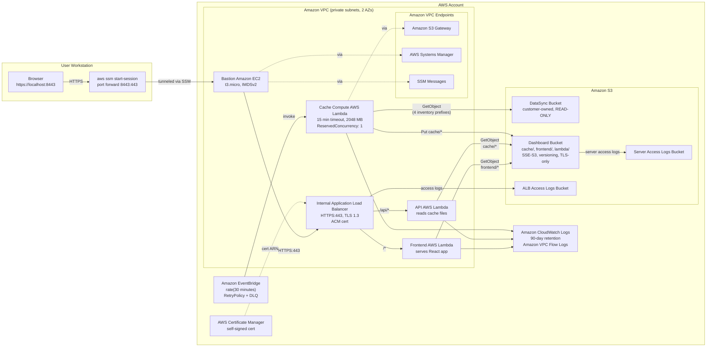

# Architecture

> **Disclaimer:** This is sample code, for non-production usage. You should work with your security and legal teams to meet your organizational security, regulatory and compliance requirements before deployment. Distributed under the [MIT-0 License](../LICENSE).

This document describes the architecture of the Multi-Account Patch Compliance Dashboard. For deeper component-level guidance see the steering files under `.kiro/steering/` and the spec documents under `.kiro/specs/patch-compliance-dashboard/`.

## System Overview

The dashboard reads patch compliance data from an existing AWS Systems Manager Resource Data Sync Amazon Simple Storage Service (Amazon S3) bucket, aggregates it into pre-computed cache files, and serves a React UI through an internal Application Load Balancer (ALB). Access is restricted to AWS Systems Manager (SSM) Session Manager port forwarding through a bastion Amazon EC2 instance — no public endpoints exist.

## Architecture Diagram

## AWS Services Used

| Service | Purpose |
|---------|---------|
| Amazon S3 | DataSync bucket (read-only customer data), Dashboard bucket (cache + frontend + Lambda zips), Application Load Balancer (ALB) access logs, S3 server access logs |
| AWS Lambda | Three functions: Cache Compute, API, Frontend (all in Amazon VPC, all Python 3.11) |
| Amazon VPC | Private subnets across 2 AZs, no NAT gateway, gateway and interface endpoints |
| Application Load Balancer | Internal-only, HTTPS:443 listener, TLS 1.3, Lambda targets |
| Amazon EC2 | Bastion host (t3.micro, IMDSv2 required, encrypted gp3 root EBS) |
| AWS Systems Manager | Resource Data Sync data source, Session Manager port forwarding for access |
| AWS Certificate Manager | Stores the TLS certificate used by the ALB listener |
| Amazon EventBridge | Scheduled rule (every 30 minutes) that invokes the Cache Compute Lambda |
| Amazon CloudWatch Logs | Lambda function logs (90-day retention), Amazon VPC Flow Logs |
| Amazon Simple Queue Service (Amazon SQS) | Dead-letter queues for the Cache Lambda and the EventBridge rule |
| AWS Identity and Access Management | Per-Lambda execution roles, bastion instance profile |
| AWS Key Management Service (AWS KMS) | AWS-managed keys by default (`aws/s3`, `aws/sqs`, `aws/logs`); customer-managed keys supported via comments |
| AWS CloudFormation | Three stacks: bucket, infrastructure, compute |

## Component Responsibilities

### Cache Compute Lambda
Runs every 30 minutes. Discovers all `accountId/region` combinations under `AWS:PatchSummary/` in the DataSync bucket, reads the four inventory types (`AWS:PatchSummary`, `AWS:InstanceInformation`, `AWS:ComplianceItem`, `AWS:Tag`) for each, aggregates compliance data, and writes the result to the Dashboard bucket.

Output structure:
- `cache/compliance-summary.json` — main dashboard rollups
- `cache/detail/{accountId}/{region}.json` — small accounts (≤500 instances)
- `cache/detail/{accountId}/{region}/meta.json` + `index.json` + `chunk_N.json` — large accounts (>500 instances)
- `cache/patches-index.json` — patch-centric view

Configured with `ReservedConcurrentExecutions: 1` to prevent overlapping invocations from racing on cache files.

#### Why two detail-cache formats

Two AWS limits drive the chunked layout for large accounts:

- **ALB → Lambda response limit (1 MB)**. A single account with thousands of instances easily exceeds this if it is returned as one payload, so the API Lambda needs a way to return one page of instances without loading the rest.
- **Lambda memory headroom**. Loading 20,000 instances with their patch lists into memory uses gigabytes. The cache writer handles this by chunking on write; the reader handles it by only loading the chunks it needs.

When an account has more than 500 instances, the cache writer produces a directory of files instead of a single JSON:

| File | Fetched on | Purpose |
|---|---|---|
| `meta.json` | every detail view | Lightweight metadata: `totalInstances`, `chunkSize`, `totalChunks`, `platformSummary`, `availableTags`. Drives the summary cards and tag filter. |
| `chunk_N.json` | only when its instances are on the visible page | 500 instances per chunk. For a 20,000-instance account viewed at 500 per page, the API Lambda reads exactly one chunk per page request. |
| `index.json` | only when the user clicks a specific instance | `instanceId → chunk_N` lookup table. A single-instance fetch is two reads (`index.json` plus the right chunk) instead of scanning every chunk. |

On a detail request the API Lambda probes for `meta.json` first. If it exists, the request follows the chunked path; if not, it reads the single-file format and slices the requested page in memory. This keeps the API forward-compatible with both layouts and lets the cache writer choose per-account based on size at write time.

### API Lambda
Serves three routes: `/api/compliance-summary`, `/api/compliance-detail`, `/api/patches-index`. Reads only from `cache/*` in the Dashboard bucket. Validates input with regex (`^\d{12}$` for account IDs, `^[a-z]{2}-[a-z]+-\d$` for regions) and clamps pagination parameters before any S3 lookup.

### Frontend Lambda
Serves the React SPA from `frontend/*` in the Dashboard bucket. Returns `index.html` for any path not matching a static asset. Emits security response headers (CSP, HSTS, X-Frame-Options, X-Content-Type-Options, Referrer-Policy, Permissions-Policy) on every response. Detects path traversal via `posixpath.normpath`.

### Bastion EC2
Sole entry point for users. No SSH keys, no public IP. Reachable only through Session Manager port forwarding. IMDSv2 required, encrypted gp3 root volume.

## Security Architecture

For the full security baseline see [SECURITY.md](SECURITY.md). For the threat model see [THREAT_MODEL.md](THREAT_MODEL.md).

Summary of cross-cutting controls:
- **Network**: Amazon VPC-only Lambda placement, internal ALB, Amazon VPC endpoints scoped to specific bucket prefixes (Dashboard) and account principal (DataSync), no NAT, no public IPs anywhere
- **Encryption at rest**: SSE-S3 default with customer-managed AWS KMS key swap documented
- **Encryption in transit**: HTTPS:443 only on ALB with TLS 1.3 policy; bucket policies deny non-TLS S3 access; AWS service traffic over Amazon VPC endpoints terminates with HTTPS
- **Identity**: Per-Lambda IAM roles, prefix-scoped S3 permissions, no shared roles, no hardcoded role names
- **Compute hardening**: IMDSv2 required on bastion, encrypted gp3 EBS, `ReservedConcurrentExecutions` on every Lambda (Cache: 1 to prevent cache-write races; API: 25; Frontend: 50) with paired CloudWatch throttle alarms
- **Observability**: 90-day CloudWatch retention, Amazon VPC Flow Logs, ALB access logs, S3 server access logs, X-Ray on Cache Lambda, dead-letter queues on async Lambda + EventBridge target
- **Input handling**: Regex validation on path/query parameters, page/pageSize clamping, explicit ValueError/KeyError handling, CSV formula-prefix neutralization
- **Output hardening**: Security response headers on all frontend responses, no `dangerouslySetInnerHTML`, `noopener,noreferrer` on external links

## CloudFormation Layout

Three stacks deployed in order:

1. **`bucket.yaml`** — Dashboard bucket, server access log bucket. `DeletionPolicy: Retain` on the dashboard bucket so cache survives compute redeploys.
2. **`infrastructure.yaml`** — Amazon VPC, subnets, route tables, Amazon VPC endpoints, security groups, bastion EC2, instance profile, Amazon VPC Flow Log.
3. **`compute.yaml`** — Three Lambda functions and their roles, ALB and listener, target groups, EventBridge schedule, dead-letter queues, ALB access log bucket, CloudWatch log groups.

Cross-stack references via `Fn::ImportValue`. Bucket names threaded via parameters so the IAM ARNs in `compute.yaml` and the endpoint policy in `infrastructure.yaml` resolve to the same bucket.

## Where to find more detail

| Topic | Location |
|-------|----------|
| Compute and access decisions | [`.kiro/steering/architecture.md`](../.kiro/steering/architecture.md) |
| Security baseline (S3, TLS, IAM, headers, validation) | [`.kiro/steering/security.md`](../.kiro/steering/security.md) |
| Cache file schemas and Resource Data Sync layout | [`.kiro/steering/data-schemas.md`](../.kiro/steering/data-schemas.md) |
| Compliance determination rules | [`.kiro/steering/compliance-logic.md`](../.kiro/steering/compliance-logic.md) |
| Frontend UI specifications | [`.kiro/steering/frontend-specs.md`](../.kiro/steering/frontend-specs.md) |
| Spec requirements | [`.kiro/specs/patch-compliance-dashboard/requirements.md`](../.kiro/specs/patch-compliance-dashboard/requirements.md) |
| Spec design | [`.kiro/specs/patch-compliance-dashboard/design.md`](../.kiro/specs/patch-compliance-dashboard/design.md) |
| Implementation tasks | [`.kiro/specs/patch-compliance-dashboard/tasks.md`](../.kiro/specs/patch-compliance-dashboard/tasks.md) |
| Threat model | [docs/THREAT_MODEL.md](THREAT_MODEL.md) |
| Operator hardening recommendations | [docs/HARDENING.md](HARDENING.md) |
